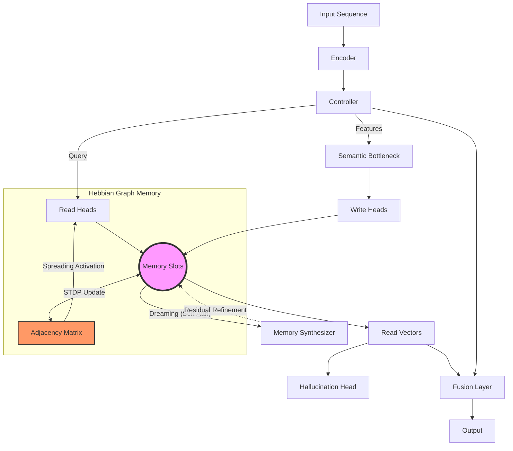

# Memory Is All You Need

> **Beyond Storage: Memory as an Active, Generative, and Self-Organizing System**

This project explores a paradigm shift in deep learning:

> **What if memory were not just a static container, but an active participant in the reasoning process?**

Most modern architectures treat memory as a passive buffer (context window) or a simple lookup table. This repository implements **Neural architectures with Active Long-Term Memory**, capable of **Imaginative Replay**, **Meta-Cognitive Addressing**, and **Generative Reconstruction**.

The result is a research-oriented framework for experimenting with **Autonomous Cognitive Systems**, positioned at the intersection of Transformers, Neuroscience, and Continual Learning.

---

## Motivation

Transformers dominate sequence modeling but suffer from "Cognitive Myopia":
* **Passive Storage:** Information sits idle until explicitly retrieved.
* **No Abstraction:** They cannot "dream" or reorganize past experiences into new insights without new input.
* **Rigid Access:** They use a single attention mechanism for everything, lacking strategies for exploration vs. exploitation.

**This project introduces a living memory system that:**
1.  **Synthesizes** new connections between stored facts during idle times ("Sleep/Dreaming").
2.  **Adapts** its reading strategy based on uncertainty (Meta-Policy).
3.  **Hallucinates** to verify understanding (Reconstruction Loss).

---

## The Paradigm Shift

> **"Neurons that fire together, wire together." — Donald Hebb (1949)**

Modern Transformers suffer from **"Associative Blindness"**: they can recall $A$ if asked for $A$, but they struggle to spontaneously recall $B$ when seeing $A$, unless $A$ and $B$ were explicitly close in the training context.

**We solve this by making memory a Graph.**

Instead of a flat list of slots, our memory tracks **relationships**. If the model reads "Fire" and then "Smoke" sequentially, a directed edge `Fire -> Smoke` is strengthened in the memory's adjacency matrix. Future queries for "Fire" will physically activate the "Smoke" slot via **Spreading Activation**, even without direct attention.

---

## Core Architecture

The model operates in a continuous 4-stage cycle:

1.  **Perception (Encoder)**: Compresses sensory input into invariant features.
2.  **Associative Recall (Hebbian Read)**: 
    * Retrieves information via similarity (Top-K).
    * *Crucially*, activation spreads through the graph edges to recall related concepts (Spreading Activation).
3.  **Consolidation (Write & Link)**: 
    * Writes new data to slots.
    * **Updates the Graph**: Uses a temporal Hebbian rule (STDP) to strengthen connections between the previously active slots and the current ones.
4.  **Dreaming (Synthesis)**: Periodically goes offline to "dream" — running self-attention over memory slots to discover latent connections and merge redundant knowledge.

---

## Key Features

### 1. Hebbian Graph Memory (The Brain)
We implement a differentiable **Adjacency Matrix** $A$ that evolves online.
* **Update Rule (STDP):** $\Delta A_{ij} = \eta \cdot (\text{Pre}_i \times \text{Post}_j)$. If Slot $i$ was active at $t-1$ and Slot $j$ is active at $t$, the link $i \to j$ grows.
* **Spreading Activation:** When reading, the attention weights $W$ diffuse through the graph: 
    $$W_{final} = (1-\alpha)W_{base} + \alpha(W_{base} \times A)$$
    This allows the model to "remember" things it didn't explicitly look for.

### 2. Neural Memory Synthesis ("Dreaming")
Just as humans consolidate memories during sleep, this model runs a **Self-Attention mechanism over memory slots** periodically. This allows the system to:
* Discover latent connections between temporally distant events.
* Merge redundant information.
* Form abstract representations independent of the input stream.

### 3. Meta-Policy Addressing
The model is not forced to use just one retrieval strategy. A learned gating mechanism dynamically mixes three policies:
* **Top-K:** For precise, factual retrieval.
* **Uniform:** For gathering global context.
* **Random:** For stochastic exploration and breaking local minima.

### 4. Hallucination-based Learning
To ensure the memory captures the *essence* of the input, we introduce a **Reconstruction Head**. The model is penalized if it cannot "hallucinate" (reconstruct) the original input solely from its memory read vectors.

---

## Optimization & Training

The model optimizes a composite objective function:

$$L_{total} = L_{task} + \lambda_1 L_{hallucination} + \lambda_2 L_{utilization} + \lambda_3 L_{sparsity}$$

* **$L_{hallucination}$**: MSE loss between the memory reconstruction and original input.
* **$L_{utilization}$**: Entropy maximization to prevent addressing collapse (ensuring all slots are used).
* **$L_{sparsity}$**: Ensures efficient, sparse communication between Controller and Memory.

---

## Architecture Overview

---

## Implemented Components

* **`MemorySynthesizer`**: Transformer-based module for inter-slot communication.
* **`MultiHeadMemoryBank`**: Storage with Meta-Policy addressing and Age tracking.
* **`TransformerController`**: The "CPU" managing the read/write lifecycle.
* **`MemNet`**: End-to-end model with Hallucination auxiliary heads.

---

## Experiments Included

### 1. Synthetic Long-Term Dependency Task

**Goal:**
Predict tokens that appeared far outside the local context window.

**Why:**
Tests whether explicit memory outperforms attention-only baselines when context length is constrained.

Metrics:

* Accuracy vs distance
* Memory slot reuse
* Read sparsity

### 2. Continual Learning with Distribution Shifts

**Goal:**
Learn sequential tasks without catastrophic forgetting.

Memory-enabled models:

* Retain task-specific representations
* Exhibit lower forgetting curves

Baseline comparisons:

* Transformer without memory
* RNN/LSTM

### 3. Learned Forgetting Dynamics

**Goal:**
Observe how the model decides *what to forget*.

Tracked signals:

* Slot lifetimes
* Write frequency
* Entropy of read distributions

## Visualization

The repository includes tools for visualizing memory behavior:

* **Heatmaps**: Observe how information travels through slots over time.
* **Slot Survival Curves**: Track which information the model deems "worth remembering" vs "worth forgetting".

---

## Why This Project Is Different

This is **not**:

* Another larger-context Transformer
* A post-hoc interpretability tool
* A retrieval-augmented model glued together

This **is**:

* An attempt to build **System 2** thinking (slow, deliberative, consolidating) into neural networks.
* An architectural rethink
* A research playground for memory systems
* A stepping stone toward continual, adaptive AI

Memory is treated as infrastructure, not an emergent artifact.

---

## Research Directions

This repository is designed to be extended.

Potential research questions:

* Can memory heads specialize functionally?
* What is the optimal memory pressure?
* Can explicit forgetting improve alignment or privacy?
* How does explicit memory interact with planning?

---

## Intended Audience

This project is built for:

* ML / DL Engineers exploring advanced architectures
* Researchers interested in memory, continual learning, or cognitive AI
* Practitioners curious about alternatives to scaling context length

It assumes familiarity with:

* PyTorch
* Attention mechanisms
* Sequence modeling

---

## Status

This is an **experimental research codebase**.

The goal is insight, not benchmark chasing.

Expect:

* Clean abstractions
* Extensive logging
* Easily modifiable components

---

## License

This project is open-source and available under the MIT License.
