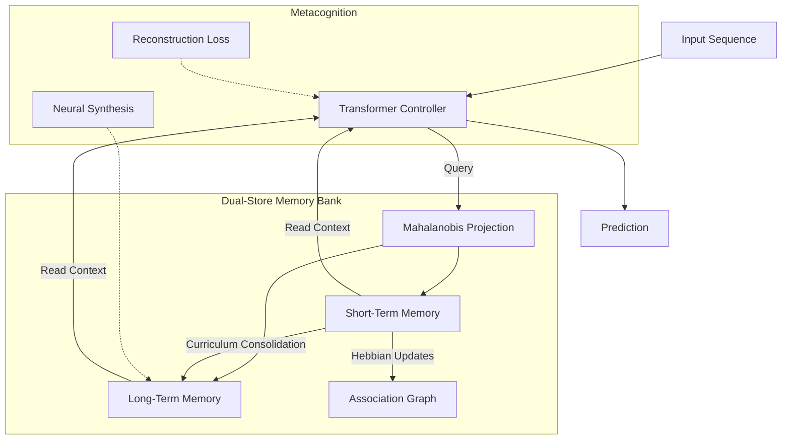

# Memory Is All You Need

[](https://opensource.org/licenses/MIT)
[](https://pytorch.org/)
[]()
[](https://colab.research.google.com/drive/1V4VOdKP95wKkcNZxYwwI-1uXegVjFPKM?usp=sharing)

> **Beyond Storage: Memory as an Active, Generative, and Self-Organizing System**

This project explores a paradigm shift in deep learning:

> **What if memory were not just a static container, but an active participant in the reasoning process?**

Most modern architectures treat memory as a passive buffer (context window) or a simple lookup table. This repository implements **Neural architectures with Active Dual-Store Memory**, capable of **Imaginative Replay**, **Mahalanobis-like Addressing**, and **Curriculum Consolidation**.

The result is a research-oriented framework for experimenting with **Autonomous Cognitive Systems**, positioned at the intersection of Transformers, Neuroscience, and Continual Learning.

---

## 🧠 Motivation: Curing "Cognitive Myopia"

Transformers dominate sequence modeling but suffer from fundamental limitations:
* **Passive Storage:** Information sits idle until explicitly retrieved.
* **No Abstraction:** They cannot "dream" or reorganize past experiences into new insights without new input.
* **Rigid Access:** Standard cosine similarity treats all memory dimensions equally, ignoring feature importance.

**This project introduces a living memory system that:**
1.  **Segregates** experience into Short-Term (STM) and Long-Term (LTM) storage (Hippocampal/Cortical theory).
2.  **Learns How to Search** using a learnable Mahalanobis metric instead of fixed cosine similarity.
3.  **Consolidates Strategically** based on information entropy (System 2 filtering).

---

## 🏗 The Architecture: "System 2" in Code

We implement a **differentiable Dual-Store Memory System** inspired by Complementary Learning Systems (CLS) theory.


```mermaid
graph TD
    Input[Input Sequence] --> Controller[Transformer Controller]
    Controller --> |Query| Metric[Mahalanobis Projection]
    
    subgraph "Dual-Store Memory Bank"
        Metric --> STM[Short-Term Memory]
        Metric --> LTM[Long-Term Memory]
        STM --> |Curriculum Consolidation| LTM
        STM --> |Hebbian Updates| Graph[Association Graph]
    end
    
    STM --> |Read Context| Controller
    LTM --> |Read Context| Controller
    Controller --> Output[Prediction]
    
    subgraph "Metacognition"
        Dreaming[Neural Synthesis] -.-> LTM
        Hallucination[Reconstruction Loss] -.-> Controller
    end

```

### Key Mechanisms

* **Dual-Store Memory (STM + LTM):**
* **STM:** Rapid plasticity, fast decay. Captures the "now".
* **LTM:** Slow plasticity, stable storage. Captures the "concepts".


* **Mahalanobis-like Addressing:**
* The model learns a projection matrix  to transform queries. It decides *which* features matter for retrieval dynamically.


* **Curriculum Consolidation:**
* Instead of moving everything to LTM, the model calculates the **entropy of utilization**. Only high-salience memories are consolidated.


* **Hallucination Loss:**
* A self-supervised objective where the model must reconstruct the original input from its memory state alone.


---

## ⚡ Why This Project Is Different

This is **not**:

* Another larger-context Transformer.
* A post-hoc interpretability tool.
* A simple RAG (Retrieval-Augmented Generation) wrapper.

This **is**:

* An attempt to build **System 2 thinking** (slow, deliberative, organizing) into neural networks.
* An architectural rethink of how gradients flow through time.
* A research playground for **Metric Learning** inside memory systems.

---

## 🚀 Getting Started

### Installation

```bash
git clone https://github.com/Ant1pozitive/memory-is-all-you-need.git
cd memory-is-all-you-need
pip install -r requirements.txt
```

### Run the Cognitive Demo

See the dual-memory system in action (visualizing STM vs LTM activation):

```bash
jupyter notebook demo_comparison.ipynb
```

### Training

Train the full model on the algorithmic Copy Task with long delays:

```bash
python train.py --config config.py
```

---

## ⚙️ Configuration (Research Mode)

You can toggle the cognitive modules in `config.py`:

```python
# Enable learnable metric (Mahalanobis)
cfg.memory.use_learnable_metric = True 

# Enable adaptive thresholding for consolidation
cfg.memory.use_dynamic_consolidation = True 

# Set memory pressure
cfg.memory.stm_slots = 64
cfg.memory.ltm_slots = 1024
```

---

## 📊 Status

This is an **experimental research codebase**.
The goal is insight, not just benchmark chasing.

Expect:

* Clean abstractions (`MemoryBank`, `Controller`)
* Extensive logging and visualization tools
* Code that prioritizes readability over hyper-optimization

---

## Citation & License

This project is licensed under the MIT License.

*Authored by Ant1pozitive*